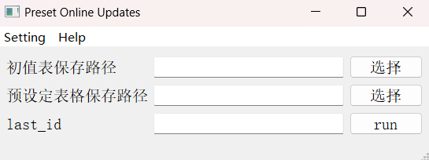
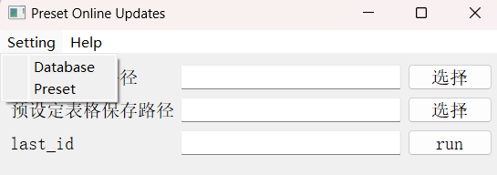
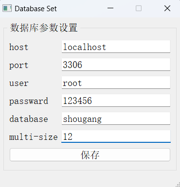
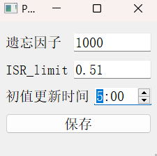

# GUI设计

主界面

选择初值表的保存路径、预设定表格的保存路径，指定上一次更新的`id`，点击`run`

菜单栏：

Setting：设置**数据库**（database）和**预设定更新**（preset）的相关参数

Database的设置界面：修改完毕后，点击保存即可

| 参数       | 释义                     |
| ---------- | ------------------------ |
| host       | 数据库地址               |
| port       | 数据库端口号             |
| user       | 用户                     |
| passward   | 密码                     |
| database   | 数据库名称               |
| multi-size | 指定进程数，快速处理文件 |

preset的设置界面：修改完毕后，点击保存即可

| 参数         | 释义                               |
| ------------ | ---------------------------------- |
| 遗忘因子     | 预设定在线更新对历史样本的取舍策略 |
| ISR_limit    | 中间辊窜辊限值                     |
| 初值更新时间 | 每天5:00自动执行程序               |

